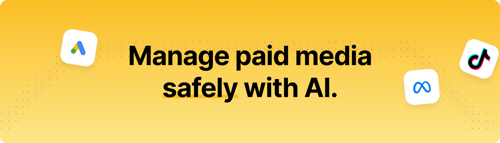

# HYPD AI - Paid Ads & Analytics

Analyze your paid marketing in plain language, inside Claude. HYPD connects your **Google Ads**, **Meta (Facebook) Ads**, **Google Analytics (GA4)** and **Merchant Center** accounts, then answers questions about them using your real account data.

**Read-only.** HYPD reports on your accounts and never changes your campaigns, budgets or ads.

Works in **Claude Code** (terminal, desktop, IDE) and **Claude Cowork**. Step-by-step guide with screenshots: [docs.hypd.ai/guides/claude-code-plugin](https://docs.hypd.ai/guides/claude-code-plugin).

## Install

### Claude Code (terminal)

```
/plugin marketplace add HYPD-AI/ads-mcp-plugin
/plugin install hypd-ai-ads@hypd-ai
/reload-plugins
```

Then authorize: `/mcp` → **hypd** → **Authenticate** (or run `claude mcp login 'plugin:hypd-ai-ads:hypd'` from a normal terminal). A terminal install also covers the desktop app's Code tab.

### Desktop app & Claude Cowork

Settings → **Customize** → **Plugins** → **Add** → **Add marketplace** → **Add from a repository** → enter `HYPD-AI/ads-mcp-plugin` → **Sync**. Then install **HYPD AI - Paid Ads & Analytics** from the **Personal** tab and connect the **HYPD AI Ads** connector on the plugin's page.

A terminal install does not carry over to Cowork — use this path there.

### Zip upload (no marketplace)

Download [`hypd-ai-ads.zip`](https://github.com/HYPD-AI/ads-mcp-plugin/releases/latest/download/hypd-ai-ads.zip), then **Add** → **Upload plugin** in the desktop app. Or load it for a single session:

```
claude --plugin-dir ./hypd-ai-ads.zip
```

Uploaded copies don't update automatically — prefer the marketplace installs above.

## What you can do

- **Google Ads** — campaign performance, spend, ROAS and CPA, account overviews, custom queries across any date range
- **Meta (Facebook) Ads** — campaign, ad set and ad performance, creative details, audience insights, catalogs, lead forms
- **Meta Ad Library** — search competitors' live and past ads across Facebook and Instagram
- **Google Analytics (GA4)** — ecommerce and campaign performance, landing pages, funnels, conversion paths, attribution comparison
- **Merchant Center** — feed diagnostics, disapproved products, product performance, price competitiveness, competitive visibility
- **Research** — keyword ideas and search volume, competitor ads via Google Ads Transparency, live SERP and Shopping data
- **Landing pages** — instant quality audits, performance scores, resource breakdowns, screenshots
- **Prompt templates, marketing skills and saved business context**, so every answer reflects your accounts, brand and goals

Try:

```
Audit my account and tell me where budget is being wasted.
How are my Meta ads performing, and which creatives are fatiguing?
Compare attribution between Google Analytics and Google Ads.
Show the ads a competitor is running on Facebook and Instagram.
```

## Requirements

A HYPD account. Sign up at [app.hypd.ai](https://app.hypd.ai) and connect at least one ad account on the **Sources** page. Authentication happens over OAuth the first time you use the plugin.

## Data and privacy

- **No hooks.** This plugin registers no lifecycle hooks and observes nothing outside explicit tool calls.
- **No telemetry.** The only network destination is HYPD's own API (`mcp.hypd.ai`), reached through the MCP connection you authorize.
- **Read-only.** No tool creates, edits, pauses or deletes anything in any connected platform.

## Links

[Website](https://www.hypd.ai) · [Dashboard](https://app.hypd.ai) · [Google Ads MCP](https://www.hypd.ai/google-ads-mcp) · [Meta Ads MCP](https://www.hypd.ai/meta-ads-mcp) · [Documentation](https://docs.hypd.ai) · [Privacy Policy](https://www.hypd.ai/privacy) · [Terms](https://www.hypd.ai/terms) · [Support](mailto:contact@hypd.ai) · [LinkedIn](https://www.linkedin.com/company/wearehypd)

## License

MIT. See [LICENSE](./LICENSE).
